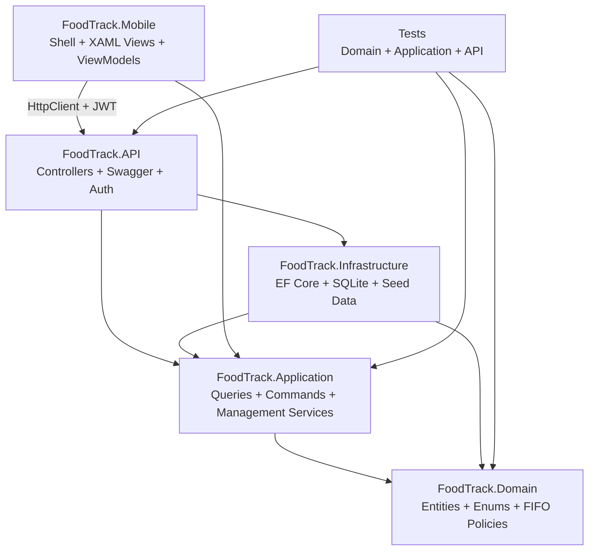
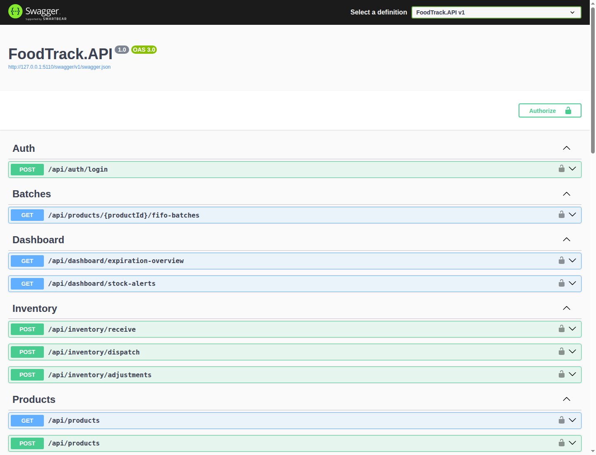

# FoodTrack ERP

[](https://github.com/Patrik652/patrik-foodtrack-erp/actions/workflows/ci.yml)

FoodTrack ERP je portfolio demo pre C#/.NET pozíciu v Starbug s.r.o. Repo teraz obsahuje dokončený ASP.NET Core 8 backend, reálnu .NET MAUI mobilnú appku pod `src/FoodTrack.Mobile`, JWT autentifikáciu pre skladové write flow, Docker support a rozšírené automatizované testy.

## Scope

- ASP.NET Core 8 Web API nad EF Core 8 a SQLite
- Clean Architecture vrstvy `Domain -> Application -> Infrastructure -> API/Mobile`
- FIFO vyskladnenie a expirácie `30 / 14 / 7` dní
- Operator login cez badge code + PIN s bearer tokenmi
- CRUD/read-management surface pre produkty, batch detail a stock movement históriu
- Android-first .NET MAUI app pod `src/FoodTrack.Mobile/` s `Shell`, login, inventory listom, batch detailom, receive/dispatch/adjust flow a dashboardom
- Dockerfile pre API a root `docker-compose.yml`
- xUnit + FluentAssertions coverage cez domain, application a API integration

## Tech Highlights

- Clean Architecture
- FIFO stock rotation
- Batch expiration alerts
- Operator auth with JWT
- MAUI mobile shell
- Docker support
- 36+ automated tests

## CI/CD

GitHub Actions workflow je v `.github/workflows/ci.yml` a na každom `push`/`pull request` vykoná:

- `dotnet restore FoodTrack.sln`
- `dotnet build FoodTrack.sln --configuration Release`
- `dotnet test FoodTrack.sln --filter "FullyQualifiedName!~FoodTrack.Mobile"`
- `docker compose -f docker-compose.yml config`
- `docker compose build foodtrack-api`
- upload `.trx` výsledkov ako CI artifact

## Architecture



## Solution Layout

- `src/FoodTrack.Domain` obsahuje čisté entity, enumy a business pravidlá bez externých závislostí.
- `src/FoodTrack.Application` drží DTO, query/command služby, auth flow a management surface.
- `src/FoodTrack.Infrastructure` implementuje EF Core repozitáre, `DbContext` a seeded demo dáta.
- `src/FoodTrack.API` vystavuje Swagger API, JWT autentifikáciu a warehouse endpoints.
- `src/FoodTrack.Mobile` obsahuje reálny .NET MAUI app projekt s `UseMaui`, `Platforms`, `Resources`, XAML views, viewmodelmi a `HttpClient` service layerom.
- `tests/FoodTrack.Domain.Tests` pokrýva entity a FIFO pravidlá.
- `tests/FoodTrack.Application.Tests` pokrýva query/command/auth služby.
- `tests/FoodTrack.API.Tests` spúšťa reálny HTTP pipeline cez `WebApplicationFactory`.

## Demo Credentials

Seeded operátori:

- `OP-1001 / 1234` -> `Roman Skladnik`
- `OP-1002 / 2345` -> `Jana Expedicia`
- `OP-1003 / 3456` -> `Marek Pekar`

Seeded produkty:

- `Mlieko Tatranske 1L`
- `Kuracie Prsia Chladene 1kg`
- `Rozok Bily 60g`
- `Mineralna Voda Jemne Sycena 1.5L`

## API Surface

Anonymous read endpoints:

- `POST /api/auth/login`
- `GET /api/dashboard/expiration-overview`
- `GET /api/dashboard/stock-alerts`
- `GET /api/products`
- `GET /api/products/{productId}`
- `GET /api/products/{productId}/fifo-batches`
- `GET /api/batches/{batchId}`
- `GET /api/stock-movements`
- `GET /api/stock-movements/{movementId}`

Authenticated warehouse/admin endpoints:

- `POST /api/products`
- `PUT /api/products/{productId}`
- `DELETE /api/products/{productId}`
- `POST /api/inventory/receive`
- `POST /api/inventory/dispatch`
- `POST /api/inventory/adjustments`
- `POST /api/batches/{batchId}/recall`
- `PUT /api/batches/{batchId}`
- `DELETE /api/batches/{batchId}`

Swagger používa bearer security scheme. Najprv zavolaj `POST /api/auth/login`, potom vlož vrátený token do `Authorize`.

## Swagger Preview

Živý screenshot z lokálne spusteného Swagger UI:



## Quick Demo

Spusti API:

```bash
export PATH="$HOME/.dotnet:$PATH"
dotnet run --project src/FoodTrack.API --urls http://localhost:5099
```

Základné read endpointy:

```bash
curl http://localhost:5099/api/products
curl http://localhost:5099/api/dashboard/expiration-overview
curl http://localhost:5099/api/dashboard/stock-alerts
```

Login a token:

Quick demo používa `jq` na vytiahnutie identifikátorov z JSON odpovedí.

```bash
export TOKEN=$(curl -sS -X POST http://localhost:5099/api/auth/login \
  -H 'Content-Type: application/json' \
  --data '{"badgeCode":"OP-1001","pin":"1234"}' | jq -r '.accessToken')
```

Receive batch:

```bash
PRODUCT_ID=$(curl -sS http://localhost:5099/api/products | jq -r '.[0].id')
RECEIVE_RESPONSE=$(curl -sS -X POST http://localhost:5099/api/inventory/receive \
  -H "Authorization: Bearer $TOKEN" \
  -H 'Content-Type: application/json' \
  --data "{
    \"productId\":\"$PRODUCT_ID\",
    \"batchNumber\":\"LOT-DEMO-001\",
    \"manufactureDate\":\"2026-04-13T00:00:00Z\",
    \"expirationDate\":\"2026-05-15T00:00:00Z\",
    \"quantity\":10,
    \"location\":\"A-01-09\",
    \"note\":\"README quick demo receive\",
    \"receivedAtUtc\":\"2026-04-13T06:45:00Z\"
  }")
BATCH_ID=$(printf '%s' "$RECEIVE_RESPONSE" | jq -r '.batchId')
printf '%s\n' "$RECEIVE_RESPONSE"
```

Dispatch stock:

```bash
curl -X POST http://localhost:5099/api/inventory/dispatch \
  -H "Authorization: Bearer $TOKEN" \
  -H 'Content-Type: application/json' \
  --data "{
    \"productId\":\"$PRODUCT_ID\",
    \"quantity\":1,
    \"dispatchedAtUtc\":\"2026-04-13T06:46:00Z\",
    \"note\":\"README quick demo dispatch\"
  }"
```

Recall batch:

```bash
curl -X POST http://localhost:5099/api/batches/$BATCH_ID/recall \
  -H "Authorization: Bearer $TOKEN"
```

Dashboard a audit filter:

```bash
curl http://localhost:5099/api/dashboard/expiration-overview
curl http://localhost:5099/api/dashboard/stock-alerts
curl "http://localhost:5099/api/stock-movements?batchId=$BATCH_ID"
```

## Postman Collection

Repo obsahuje aj import-ready Postman artefakty:

- `docs/postman/FoodTrackERP.postman_collection.json`
- `docs/postman/FoodTrackERP.local.postman_environment.json`

Collection si sama uloží `jwtToken`, prvý `productId` a následne aj `batchId` z `receive` requestu, takže demo flow ide spustiť priamo sekvenčne.

## Demo Video

Swagger UI walkthrough — login, produkty, dashboard, stock alerty, inventory endpointy:

https://github.com/Patrik652/patrik-foodtrack-erp/releases/download/v1.0.0/foodtrack-demo.mp4

Skript na regenerovanie videa: `node scripts/record-demo-video.mjs`

## Local Setup

```bash
export PATH="$HOME/.dotnet:$PATH"
dotnet build FoodTrack.sln
dotnet test FoodTrack.sln --filter "FullyQualifiedName!~FoodTrack.Mobile"
dotnet run --project src/FoodTrack.API
```

Default Swagger URL:

- `http://localhost:5262/swagger`

Mobile shell je pod `src/FoodTrack.Mobile/`. V tomto repo je udržiavaný v MAUI štruktúre a zároveň zostáva buildovateľný na tomto Linux hoste bez nainštalovaných MAUI workloadov. `MauiProgram.cs` je pripravený na pripojenie proti API cez `HttpClient` a JWT session store.
Mobilná appka je pod `src/FoodTrack.Mobile/` ako skutočný .NET MAUI projekt so `Shell` navigáciou, `Platforms/*`, `Resources/*`, XAML stránkami a JWT `HttpClient` vrstvou. Default solution verification na tomto Linux hoste stavia backend a test projekty; samotný MAUI head sa v solution konfigurácii nebuildí automaticky, aby verify nevyžadoval plný Android SDK/JDK toolchain.

## Docker

Build a run API v containery:

```bash
docker compose up --build
```

API bude dostupné na:

- `http://localhost:8080/swagger`

SQLite databáza sa ukladá do named volume `foodtrack-data`.

## Mobile Notes

`src/FoodTrack.Mobile/` obsahuje:

- `FoodTrack.Mobile.csproj` s `UseMaui=true` a Android-first targetom
- `AppShell.xaml` s TabBar navigáciou `Scan`, `Inventory`, `Dashboard`, `Settings`
- `Platforms/Android`, `Platforms/iOS`, `Platforms/MacCatalyst`, `Platforms/Windows`
- `Views/LoginPage.xaml` pre operator login
- `Views/ProductListPage.xaml` so search/filter a refresh UI
- `Views/BatchDetailPage.xaml` s movement históriou
- `Views/ReceiveStockPage.xaml`, `Views/DispatchStockPage.xaml`, `Views/AdjustStockPage.xaml`
- `Views/DashboardPage.xaml` s expiracnym summary
- `Services/ApiService.cs` s bearer token auth na backend
- viewmodely s loading stavmi a offline-friendly error hláškami

Automatizované testy v solution:

- `FoodTrack.Domain.Tests`: `6`
- `FoodTrack.Application.Tests`: `10`
- `FoodTrack.API.Tests`: `14`
- `FoodTrack.Presentation.Tests`: `6`
- spolu: `36` zelených testov

## Verification

Hlavné verifikačné príkazy:

```bash
export PATH="$HOME/.dotnet:$PATH" && dotnet build FoodTrack.sln
export PATH="$HOME/.dotnet:$PATH" && dotnet test FoodTrack.sln --filter "FullyQualifiedName!~FoodTrack.Mobile"
test $(export PATH="$HOME/.dotnet:$PATH" && dotnet test FoodTrack.sln --filter "FullyQualifiedName!~FoodTrack.Mobile" --list-tests 2>/dev/null | grep -c 'test host') -ge 1
```
